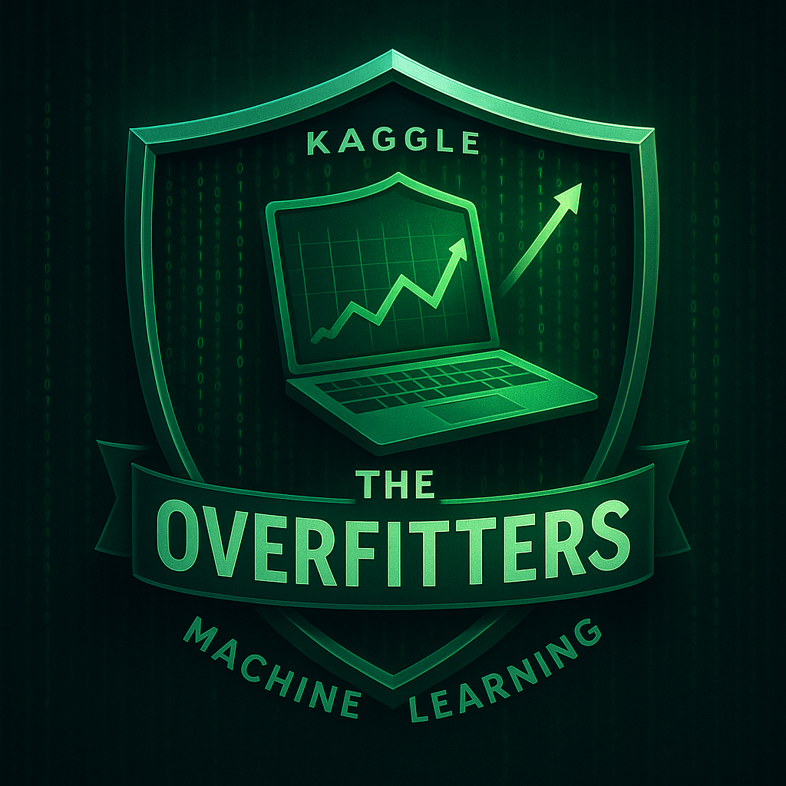

# Assignment 3: CNN Classification
https://www.kaggle.com/competitions/assignment-3-cnn-classification-fall2025/

# Versions
- **Example_original.ipynb** is the final code from the closing of the competition deadline (after finishing EfficientNetV2-B2, we moved on to efficientnetv2_b3 this can be seen in this file)  
- **Example.ipynb** is the Google Colab–recreated version of the best submission (efficientnetv2_b2)  
- **.env** is where you specify W&B team, API Key and project. The team name can be a little tricky to find!  

*Note: Some code blocks appear twice. This was necessary to make the notebook run correctly in Google Colab. For example, saving plots to a folder had to be modified slightly to work on Colab.*  

# Usage  
I recommend clearing all existing cell outputs and then just running the notebook again from top to bottom.  

# Relevant Papers  

**Evaluating Deep Learning Models for Breast Cancer Classification: A Comparative Study**  
https://arxiv.org/abs/2408.16859  

**A survey of the recent architectures of deep convolutional neural networks**  
https://link.springer.com/article/10.1007/s10462-020-09825-6  

**Cancer image classification based on DenseNet model**  
https://arxiv.org/pdf/2011.11186  

# CNN Atlas (list of CNNs)  
https://www.notion.so/b5442f8f80624d0db3df2ad01dd51ef7?v=5cc0c348481c4de1b974a5c094889080&source=copy_link  
